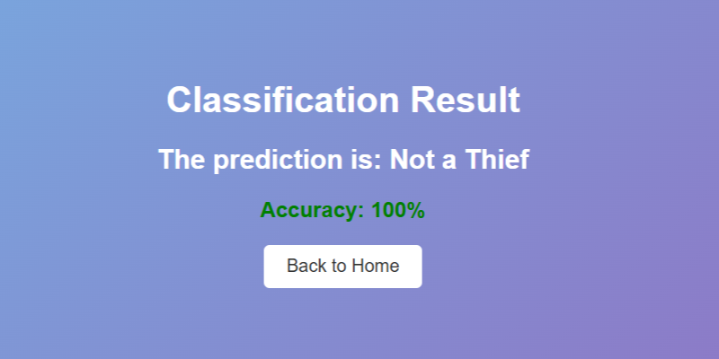

# 🎥 Thief Video Classifier 🚨  

## 📌 Table of Contents  
- [📌 Overview](#-overview)  
- [🚀 Features](#-features)  
- [🏗 Model Summary](#-model-summary)  
- [📈 Performance](#-performance)  
- [✔️ Classification Report](#-classification-report)  
- [🛠 Technologies Used](#-technologies-used)  
- [📊 Results](#-results)  

## 📌 Overview  
An **AI-powered video surveillance system** designed to detect **shoplifting** using **deep learning** and **computer vision**. The model processes video frames to identify potential shoplifters, enhancing security in retail environments.  

## 🚀 Features    
✅ **Deep Learning Model (CNN + LSTM)**  
✅ **3D Convolution for Video Analysis**  
✅ **Batch Normalization & Dropout for Stability**  
✅ **High Accuracy (99.5%)**  

## 🏗 Model Summary  
🔹 **3D Convolutional Neural Networks (CNNs)** – Extracts spatial-temporal features from video  
🔹 **LSTM (Long Short-Term Memory)** – Tracks movement patterns  
🔹 **Batch Normalization & Dropout** – Enhances model stability & generalization  
🔹 **Fully Connected Layers** – Final classification  

## 📊 Performance  
🔹 **Training Accuracy:** `99.5%`  
🔹 **Test Accuracy:** `99.74%`  
🔹 **No Misclassifications (100% Precision & Recall)**  

## ✔️ Classification Report  
| Class              | Precision | Recall | F1-Score |  
|--------------------|-----------|--------|----------|  
| 🟩 **Non-Shoplifters** | `1.00` | `1.00` | `1.00` |  
| 🟥 **Shoplifters**     | `1.00` | `1.00` | `1.00` |  

## 🛠 Technologies Used  
🔹 **TensorFlow & Keras** – Deep learning framework  
🔹 **OpenCV** – Video processing  
🔹 **Scikit-learn** – Model evaluation  

## 📊 Results  

### 🏠 Home Page  
  

### 📂 Upload Video  
  

### 📤 Video Uploaded  
  

### 📊 Detection Results  
  

